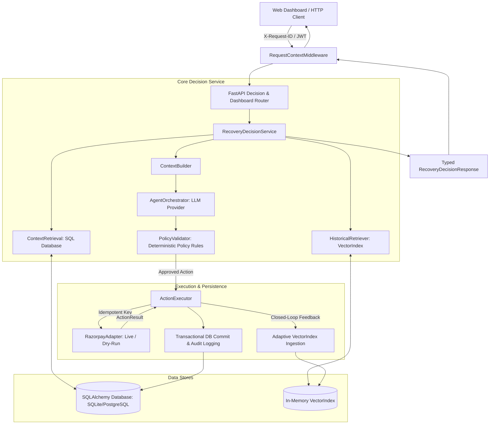

# Revora

**AI-powered payment recovery agent using customer context, historical RAG, policy-gated LLM decisioning, and Razorpay execution.**

Revora analyzes failed payments, combines customer payment behavior with historical recovery precedents, generates a structured recovery recommendation, validates it through deterministic safety policies, and executes only approved actions through the payment gateway.

---

## The Core Invariant

$$\textbf{The LLM Recommends} \longrightarrow \textbf{The Policy Layer Governs} \longrightarrow \textbf{Approved Actions Execute}$$

> **Revora is NOT an unconstrained autonomous agent with direct financial access.**  
> The Large Language Model acts strictly as an advisory reasoning layer. The deterministic `PolicyValidator` authoritatively enforces payment network mandates, RBI/3DS2 regulatory limits, fraud declines, and retry budgets before any external gateway API call is dispatched.

---

## Problem

Failed payments cause severe, recoverable revenue loss for online merchants and subscription businesses. However, naive recovery approaches introduce significant operational risks:

* **Heterogeneous Failure Root Causes**: A bank server timeout, an insufficient funds error, an interactive 2FA challenge, an expired credit card, and a fraud halt all require fundamentally different recovery strategies.
* **Network & Card Penalties**: Blindly retrying failed card transactions violates card network regulations (e.g., Visa/Mastercard retry rules) and risks issuer merchant blocking.
* **Customer Friction & Drop-Off**: Forcing customers to re-enter details for transient bank errors creates friction, while failing to provide payment links for 2FA drops viable sales.
* **AI Safety in Financial Workflows**: Unbounded LLM agents can hallucinate non-existent operations, ignore regulatory constraints, or spam external gateway APIs without rate limits and idempotency protections.

---

## Solution

Revora bridges machine intelligence and financial safety by fusing two complementary information signals through a deterministic policy boundary:

```
                          ┌───────────────────────────┐
                          │   Failed Payment Event    │
                          └─────────────┬─────────────┘
                                        │
                 ┌──────────────────────┴──────────────────────┐
                 ▼                                             ▼
  ┌─────────────────────────────┐               ┌─────────────────────────────┐
  │      Customer Context       │               │       Historical RAG        │
  │   (Relational PostgreSQL/   │               │   (Runtime VectorIndex &    │
  │      SQLite Database)       │               │    Precedent Retrieval)     │
  └──────────────┬──────────────┘               └──────────────┬──────────────┘
                 │ "What kind of customer is this?"            │ "What worked in similar cases?"
                 └──────────────────────┬──────────────────────┘
                                        ▼
                          ┌───────────────────────────┐
                          │   Context Fusion Layer    │
                          └─────────────┬─────────────┘
                                        ▼
                          ┌───────────────────────────┐
                          │     LLM Reasoning         │
                          │ (HuggingFace/OpenAI/Gemini│
                          └─────────────┬─────────────┘
                                        ▼ Candidate Recommendation
                          ┌───────────────────────────┐
                          │      PolicyValidator      │ ◄── Authoritative Safety Boundary
                          │  (Regulatory/Risk Rules)  │     (Overrides Unsafe Recommendations)
                          └─────────────┬─────────────┘
                                        ▼ Approved Action
                          ┌───────────────────────────┐
                          │      ActionExecutor       │
                          └─────────────┬─────────────┘
                                        ▼ Idempotent Dispatch
                          ┌───────────────────────────┐
                          │      RazorpayAdapter      │
                          │   (Payment Links/Retry)   │
                          └─────────────┬─────────────┘
                                        ▼ Outcome Result
                 ┌──────────────────────┴──────────────────────┐
                 ▼                                             ▼
  ┌─────────────────────────────┐               ┌─────────────────────────────┐
  │     Database Audit Log      │               │   Adaptive Vector Ingestion │
  │   (AuditEvent Persistence)  │               │   (Future Retrieval Cases)  │
  └─────────────────────────────┘               └─────────────────────────────┘
```

* **Customer Context answers**: *"What is this customer's transaction history, tenure, and historical reliability?"*
* **Historical RAG answers**: *"What recovery strategy succeeded or failed for similar payment methods, failure codes, and monetary tiers in past transactions?"*
* **The PolicyValidator guarantees**: *"Does this action strictly comply with gateway constraints, fraud stops, and regulatory 2FA rules?"*

---

## Architecture

Revora follows a decoupled, layered micro-architecture separating business domain models, retrieval-augmented intelligence, policy evaluation, external gateway execution, and transactional persistence:



---

## End-to-End Request Lifecycle

1. **Ingress & Correlation**: The client issues `POST /api/recovery/decision`. The `RequestContextMiddleware` generates or sanitizes an `X-Request-ID` correlation token (bounded to $\le 128$ chars).
2. **Authentication & Tenant Verification**: The JWT Bearer token is verified by `get_current_principal`, ensuring the request is strictly scoped to the authenticated merchant/tenant.
3. **Customer Context Reconstruction**: `get_customer_context()` queries the relational database for the customer's payment history, successful vs failed payment counts, lifetime volume, and recent payment behavior.
4. **Empirical Evidence Retrieval (RAG)**: `_resolve_rag_cases()` embeds the current failure signature and performs cosine similarity search over runtime `VectorIndex` precedent documents.
5. **Context Fusion**: `ContextBuilder` compiles a structured JSON context payload containing the customer profile, current transaction details, attempt budget, retrieved historical precedents, and applicable policy envelope.
6. **Advisory LLM Reasoning**: The `AgentOrchestrator` invokes the configured LLM provider (`HuggingFaceLLMProvider` using `Qwen/Qwen3-32B`, `OpenAILLMProvider`, or `GeminiLLMProvider`). The model returns a structured `LLMRecoveryRecommendation` with confidence score, reasoning, and supporting key factors.
7. **Deterministic Policy Validation**: `PolicyValidator.validate_decision()` evaluates the candidate recommendation against applicable `PolicyRule` records. If the recommendation violates hard safety rules (e.g. attempting silent retry on a fraud decline or an OTP failure), the policy layer authoritatively overrides the action with a mandatory fallback.
8. **Pre-Execution Reservation**: `ActionExecutor` checks the database for existing completed recovery attempts under a deterministic `idempotency_key` (`rec_<opp_id>_<action>_<attempt_num>`). If an attempt is already `succeeded`, it replays the existing reference without contacting the gateway.
9. **Gateway Execution**: The `RazorpayAdapter` executes the approved operation (e.g., creating a Razorpay Payment Link via `/v1/payment_links` with customer notification and reference IDs).
10. **Transactional Persistence**: An `AuditEvent` and updated `RecoveryAttempt` record are written to the relational database in an atomic transaction.
11. **Closed-Loop Adaptation**: The completed recovery outcome is dynamically converted into a canonical `RetrievalDocument`, hashed into dense embeddings, and indexed into the runtime `VectorIndex` for immediate retrieval by future recovery decisions.

---

## Customer Context Engine

Customer context is derived entirely from backend database records rather than untrusted client payloads:

| Attribute | Source | Description |
| :--- | :--- | :--- |
| **`total_payments`** | `Customer.total_payments` | Lifetime count of attempted transactions. |
| **`successful_payments`** | `Customer.successful_payments` | Count of successfully settled transactions. |
| **`failed_payments`** | `Customer.failed_payments` | Count of failed transaction attempts. |
| **`historical_success_rate`** | Computed | Lifetime success percentage (`successful_payments / total_payments`). |
| **`total_amount`** | Relational `Payment` records | Cumulative lifetime gross transaction volume in INR. |
| **`recent_payment_behavior`** | Bounded Query ($\le 5$ records) | Chronological sequence of recent payment methods, amounts, and statuses. |
| **`attempt_budget`** | `RecoveryOpportunity` attempts | Remaining allowable recovery attempts before terminal failure. |

> **Why Bounded History?**  
> Rather than dumping unlimited transaction history into the LLM context, Revora extracts summary statistics combined with a strictly bounded sliding window of the 5 most recent transactions. This prevents token bloat, keeps inference latency low, and eliminates noise from old transactions.

---

## Retrieval-Augmented Generation (RAG) System

Revora features a decoupled, zero-external-dependency historical retrieval engine designed for fast semantic matching of payment failure patterns:

```
Historical Failure Case ──► Canonical Text Construction ──► Deterministic Hash Embedding ──► Cosine Similarity Search ──► Top-k Precedents
```

* **Canonical Document Representation**: Every historical case is converted into a normalized string representation (`canonical_text`) capturing failure reason, payment method, amount bracket, previous attempts, and recovery outcome.
* **Deterministic Embedding Service (`DeterministicLocalEmbeddingProvider`)**: Uses feature hashing with semantic token weighting and L2 normalization to produce stable 64-dimensional dense vectors without requiring external embedding API calls or GPU dependencies.
* **In-Memory `VectorIndex`**: Maintains precedent documents with exact cosine similarity search, deterministic tie-breaking, and thread-safe dynamic ingestion.
* **PII Sanitization**: All customer names, email addresses, card numbers, and internal database IDs are stripped before documents enter vector storage.
* **Empirical Evidence, Not Executable Code**: Retrieved cases provide statistical context (e.g., *"In 85% of similar UPI bank timeouts, an interactive payment link recovered the transaction within 2 hours"*), which the LLM uses as reasoning evidence.

---

## LLM Decision Layer

The LLM decision layer translates fused context into structured recovery strategies:

### Structured Output Contract (`LLMRecoveryRecommendation`)
```json
{
  "recommended_action": "payment_link",
  "confidence": 0.92,
  "reasoning": "High-value customer experiencing bank 2FA OTP timeout. Customer history shows 90% success rate on card payments. Issuing payment link allows interactive completion.",
  "key_factors": [
    "high_customer_historical_success",
    "transient_auth_failure",
    "sufficient_attempt_budget"
  ],
  "referenced_case_ids": [
    "00000000-0000-0001-0000-000000000042"
  ]
}
```

### Supported Providers & Fallback Engine
* **Hugging Face (`HuggingFaceLLMProvider`)**: Primary inference provider utilizing `Qwen/Qwen3-32B` via the Hugging Face Serverless Inference API.
* **OpenAI (`OpenAILLMProvider`)**: Compatible with `gpt-4o` and `gpt-4o-mini` with structured JSON mode.
* **Google Gemini (`GeminiLLMProvider`)**: Compatible with `gemini-1.5-flash` with response schema enforcement.
* **Deterministic Fallback (`DecisionEngine`)**: If an LLM provider encounters a timeout, rate limit, or invalid JSON output, Revora automatically triggers a deterministic fallback rule engine to return a safe action without failing the user request.

---

## Policy Safety Layer

The `PolicyValidator` is the authoritative safety boundary of Revora. Candidate LLM recommendations that violate established policies are systematically overridden:

```
Candidate Recommendation ──► Priority 1000: Hard Safety Invariants ──► Priority 800: Gateway/2FA Rules ──► Priority 500: Business Rules ──► Effective Action
```

### Implemented Policy Registry Rules

| Priority | Policy Rule ID | Trigger Condition | Prohibited Actions | Mandatory Action / Fallback |
| :---: | :--- | :--- | :--- | :--- |
| **1000** | `SAFETY_FRAUD_SECURITY_DECLINE` | `fraud_hard_decline`, `fraud_suspected`, `risk_threshold_exceeded` | `RETRY_PAYMENT`, `WAIT_AND_RETRY`, `PAYMENT_LINK`, `CHANGE_PAYMENT_METHOD` | `NO_ACTION` *(Hard Terminal Stop)* |
| **1000** | `SAFETY_MAX_ATTEMPTS_EXCEEDED` | Attempt count $\ge$ maximum configured limit | All active recovery actions | `NO_ACTION` |
| **1000** | `SAFETY_ALREADY_RECOVERED` | Payment opportunity already in `recovered` status | All recovery actions | `NO_ACTION` |
| **800** | `RZP_CUSTOMER_AUTH_2FA_REQUIRED` | `authentication_failed`, `otp_expired`, `otp_timeout`, `3ds_failed` | `RETRY_PAYMENT`, `WAIT_AND_RETRY` *(Silent retry cannot solve 2FA)* | `PAYMENT_LINK` |
| **800** | `RZP_PERMANENT_CREDENTIAL_DECLINE` | `card_expired`, `invalid_card`, `account_closed`, `stolen_card` | `RETRY_PAYMENT`, `WAIT_AND_RETRY` | `CHANGE_PAYMENT_METHOD` |
| **500** | `REVORA_INSUFFICIENT_FUNDS_PROGRESSIVE` | `insufficient_funds`, `low_balance`, `limit_exceeded` | `RETRY_PAYMENT` *(Prevents bank decline spam)* | `WAIT_AND_RETRY` |
| **500** | `REVORA_TRANSIENT_GATEWAY_RETRY` | `bank_server_down`, `bank_timeout`, `network_timeout` | None | `WAIT_AND_RETRY` / `RETRY_PAYMENT` |

---

## Supported Recovery Actions

| Recovery Action | Execution Target | Gateway Operation | Description |
| :--- | :---: | :---: | :--- |
| **`PAYMENT_LINK`** | External | `POST /v1/payment_links` | Generates a secure Razorpay Payment Link with SMS/email notification. |
| **`WAIT_AND_RETRY`** | Internal / Scheduled | None (Internal State) | Recommends a cooldown window before automated retry. |
| **`RETRY_PAYMENT`** | External / Gateway | Direct Retry Call | Dispatches an immediate retry for transient bank network errors. |
| **`CHANGE_PAYMENT_METHOD`** | Client Application | None (Merchant Prompt) | Directs the checkout application to prompt the customer for an alternate instrument. |
| **`NO_ACTION`** | Terminal Halt | None | Immediately stops recovery to prevent fraud loss or excessive retries. |

---

## Razorpay Integration & Idempotency

External communication with the Razorpay API is managed via `RazorpayAdapter`:

* **Live vs. Dry-Run Mode**: Configured via `RAZORPAY_DRY_RUN=True` (default) for safe zero-cost local development and CI testing. In live mode, requests require secure HTTPS endpoints and valid API key pairs.
* **Two-Tier Idempotency Protection**:
  1. **Revora Pre-Execution Lock**: Computes a deterministic idempotency key (`rec_<opp_id>_<action>_<attempt_num>`). Concurrent requests for the same key are caught by database unique index `ix_recovery_attempts_idempotency_key`.
  2. **Gateway Deduplication**: Passes the derived key to Razorpay as `reference_id`, preventing duplicate payment link creation if network timeouts occur after gateway processing.
* **Cross-Tenant Collision Defense**: If a client submits an idempotency key associated with another customer, the request is rejected with `HTTP 403 Forbidden`.

---

## Closed-Loop Adaptive RAG

Revora continuously improves its historical knowledge base without model retraining or reinforcement learning:

```
Recovery Attempt Dispatched ──► Gateway Execution Result ──► Relational DB Commit ──► RetrievalDocument Construction ──► Dynamic VectorIndex Ingestion
```

1. When a recovery action completes, the outcome (recovered amount, status, elapsed duration) is committed to the relational database.
2. The `RecoveryDecisionService` constructs a `RetrievalDocument` capturing the complete decision-to-outcome experience.
3. The document is embedded and immediately indexed into the shared runtime `VectorIndex`.
4. Subsequent recovery decisions for any similar failed transaction immediately retrieve this new precedent case as empirical evidence.

---

## Database Persistence & Data Model

Revora uses SQLAlchemy with SQLite (development/testing) or PostgreSQL (production).

```
┌─────────────────────────────────┐
│            Customer             │
├─────────────────────────────────┤
│ id: UUID (PK)                   │
│ email: String (Indexed)         │
│ total_payments: Integer         │
│ successful_payments: Integer    │
│ failed_payments: Integer        │
└────────────────┬────────────────┘
                 │ 1:N
                 ▼
┌─────────────────────────────────┐
│             Payment             │
├─────────────────────────────────┤
│ id: UUID (PK)                   │
│ customer_id: UUID (FK)          │
│ amount: Float                   │
│ currency: String                │
│ payment_method: String          │
│ status: String ('failed', etc)  │
│ failure_reason: String          │
└────────────────┬────────────────┘
                 │ 1:1
                 ▼
┌─────────────────────────────────┐
│       RecoveryOpportunity       │
├─────────────────────────────────┤
│ id: UUID (PK)                   │
│ payment_id: UUID (FK, Unique)   │
│ status: String ('recovered', ..)│
│ revenue_at_risk: Float          │
│ recommended_action: String      │
│ confidence: Float               │
└────────┬────────────────────────┘
         │
         ├────────────────────────────────┐ 1:N
         │ 1:N                            │
         ▼                                ▼
┌─────────────────────────────────┐ ┌─────────────────────────────────┐
│         RecoveryAttempt         │ │           AuditEvent            │
├─────────────────────────────────┤ ├─────────────────────────────────┤
│ id: UUID (PK)                   │ │ id: UUID (PK)                   │
│ opportunity_id: UUID (FK)       │ │ opportunity_id: UUID (FK)       │
│ action: String                  │ │ event_type: String              │
│ status: String                  │ │ description: Text               │
│ amount_recovered: Float         │ │ metadata_payload: JSON          │
│ idempotency_key: String (Unique)│ │ created_at: DateTime            │
└─────────────────────────────────┘ └─────────────────────────────────┘
```

---

## Request-Level Observability

Revora includes lightweight, zero-dependency request-level observability using Python `ContextVar`:

* **Request Correlation Tokens**: Every HTTP request receives a verified `request_id` (propagated in response headers as `X-Request-ID` and in response JSON as `request_id`).
* **Structured Lifecycle Logs**: Concise structured logs are emitted at all critical lifecycle stages:
  - `customer_context_built`
  - `rag_retrieval_completed`
  - `llm_decision_generated`
  - `policy_validation_completed`
  - `recovery_execution_started`
  - `recovery_execution_completed`
* **Zero PII Leakage**: Customer email addresses, payment credentials, and raw LLM prompts are strictly excluded from logs.
* **Audit Trail Integration**: `AuditEvent` records in the database automatically store `request_id` for compliance and post-incident forensic investigation.

---

## Security & Tenant Isolation

* **Cryptographic Demo Authentication**: Issues signed HMAC-SHA256 JWT access tokens (`POST /api/auth/token`) with bounded expiration times.
* **Strict Tenant Boundary Enforcement**: All database queries and dashboard metric aggregations strictly filter on `Payment.customer_id == principal.customer_id`.
* **PII Protection**: Raw database keys and customer identifiers are anonymized before LLM prompt compilation and vector indexing.
* **Input Validation & Extra Field Rejection**: Pydantic schemas reject unknown fields (`extra="forbid"`) to prevent parameter injection attacks.

---

## Evaluation & Benchmarks

Revora includes a standalone synthetic evaluation framework and regression test suite:

### Test Suite Summary

```text
pytest backend/tests
========================= 898 passed in 96.69s =========================
```

* **898 Automated Tests**: Comprehensive unit, integration, router, policy regression, idempotency, feedback, and observability test coverage.
* **50 Golden Retrieval Datasets**: Evaluates NDCG@k, Precision@k, and Mean Reciprocal Rank (MRR) for precedent matching.
* **100 Synthetic Recovery Scenarios**: Validates end-to-end recovery simulation across failure categories.

> [!NOTE]  
> **Benchmark Clarification**: Evaluation reports and test runs demonstrate a **95.6% recovery rate** and **₹1,623,750 recovered revenue** across synthetic benchmark scenarios. These figures represent simulated benchmark datasets designed to stress-test policy boundaries, not production Razorpay payment volume.

---

## Real-Time Command Dashboard

The frontend command center communicates with `GET /api/dashboard/metrics` to display metrics derived directly from the active database and runtime `VectorIndex`:

```
┌────────────────────────────────────────────────────────────────────────────────────────┐
│                          Revenue Recovery Command Center                               │
├────────────────────┬────────────────────┬────────────────────┬─────────────────────────┤
│   Recovery Rate    │   Net Recovered    │  Recovered Cases   │       Failed Cases      │
│       75.0%        │     ₹1,00,648      │      48 Cases      │         4 Cases         │
│  48 of 64 resolved │ policy-saved gross │  terminal resolved │   active in retry: 12   │
├────────────────────┴────────────────────┴────────────────────┴─────────────────────────┤
│ AI Operational Telemetry:                                                              │
│ • Execution Success Rate: 92.5%          • Policy Overrides: 6                         │
│ • RAG Precedents: 175 Documents          • Avg AI Confidence: 88%                      │
│ • Deterministic Fallbacks: 0             • Gateway Status: Dry-Run Active              │
└────────────────────────────────────────────────────────────────────────────────────────┘
```

---

## Tech Stack

| Layer | Technologies |
| :--- | :--- |
| **Backend Framework** | Python 3.12, FastAPI, Starlette |
| **Data & ORM** | SQLAlchemy 2.0, Alembic, SQLite / PostgreSQL |
| **Data Contracts** | Pydantic v2, Pydantic Settings |
| **AI / Reasoning** | Hugging Face Serverless API (`Qwen/Qwen3-32B`), OpenAI API, Google Gemini API |
| **RAG & Embeddings** | Custom in-memory `VectorIndex`, `DeterministicLocalEmbeddingProvider` |
| **Payment Gateway** | Razorpay REST API (Live & Dry-Run Client) |
| **Frontend UI** | React 18, TypeScript, Vite, Tailwind CSS, Lucide React |
| **Quality & Testing** | pytest, pytest-asyncio, Ruff linter/formatter |

---

## Project Structure

```text
adaptive-recovery agent/
├── backend/
│   ├── alembic/                      # Database migrations
│   ├── app/
│   │   ├── agent/                    # LLM providers, prompts, and context builder
│   │   │   ├── context_builder.py    # Fuses customer context & RAG into prompt schema
│   │   │   ├── factory.py            # LLM provider factory
│   │   │   ├── huggingface_provider.py # Qwen3-32B Hugging Face implementation
│   │   │   ├── openai_provider.py    # OpenAI GPT implementation
│   │   │   ├── gemini_provider.py    # Google Gemini implementation
│   │   │   ├── orchestrator.py       # Manages agent execution lifecycle & fallback
│   │   │   └── schemas.py            # Pydantic LLM request/response contracts
│   │   ├── evaluation/               # Benchmark suites, recovery simulators, metrics
│   │   ├── policies/                 # Deterministic policy rules and PolicyValidator
│   │   │   ├── registry.py           # Safety invariants, gateway rules, merchant policies
│   │   │   ├── resolver.py           # Resolves applicable policies for payment contexts
│   │   │   └── schemas.py            # Policy rule schema contracts
│   │   ├── routers/                  # HTTP route handlers
│   │   │   ├── decision.py           # /api/recovery/decision & /api/auth/token
│   │   │   ├── dashboard.py          # /api/dashboard/metrics
│   │   │   └── recovery.py           # Legacy /v1/recovery evaluation endpoints
│   │   ├── schemas/                  # Request/Response API DTOs
│   │   │   ├── decision.py           # Decision request and response schemas
│   │   │   └── dashboard.py          # Real-time dashboard KPI schemas
│   │   ├── action_executor.py        # Validates and dispatches approved actions
│   │   ├── config.py                 # Pydantic environment configuration
│   │   ├── context_retrieval.py      # Database customer context builder
│   │   ├── database.py               # SQLAlchemy database session lifecycle
│   │   ├── dashboard_service.py      # Computes tenant-scoped dashboard metrics
│   │   ├── embedding_service.py      # Feature-hashing deterministic embeddings
│   │   ├── models.py                 # SQLAlchemy relational ORM models
│   │   ├── observability.py          # ContextVar request correlation tracing
│   │   ├── razorpay_adapter.py       # Razorpay API client (live & dry-run)
│   │   ├── recovery_decision_service.py # Core decision orchestration service
│   │   ├── vector_index.py           # In-memory vector store & cosine similarity
│   │   ├── vector_seeder.py          # Seeds runtime VectorIndex from historical cases
│   │   └── main.py                   # FastAPI application & middleware registry
│   ├── tests/                        # 898 unit, integration, and regression tests
│   └── requirements.txt              # Python dependencies
├── frontend/
│   ├── src/
│   │   ├── api/                      # Typed API clients (recovery.ts, dashboard.ts)
│   │   ├── components/               # UI components (MetricCard, PaymentCaseCard, etc)
│   │   ├── data/                     # Demo payment scenario fixtures
│   │   ├── pages/                    # Dashboard & Recovery Console views
│   │   └── types/                    # TypeScript interfaces
│   ├── package.json                  # Frontend dependencies
│   └── vite.config.ts                # Vite build configuration
└── README.md
```

---

## API Reference

### 1. Request Authentication Token
```http
POST /api/auth/token
Content-Type: application/json

{
  "customer_id": "e9cd4c97-979b-4753-9925-640623f74eee"
}
```

### 2. Evaluate Recovery Decision & Execute
```http
POST /api/recovery/decision
Authorization: Bearer <token>
Content-Type: application/json
X-Request-ID: trace_req_019283019283

{
  "amount": 2500.0,
  "currency": "INR",
  "payment_method": "card",
  "failure_reason": "authentication_failed",
  "payment_status": "failed",
  "execute_action": true,
  "max_attempts": 3,
  "idempotency_key": "client_order_882910_attempt_1"
}
```

**Response**:
```json
{
  "recommended_action": "payment_link",
  "confidence": 0.92,
  "reasoning": "2FA authentication challenge required. PolicyValidator approved Razorpay Payment Link.",
  "policy_overridden": false,
  "request_id": "trace_req_019283019283",
  "execution": {
    "action": "payment_link",
    "attempted": true,
    "status": "success",
    "success": true,
    "persisted": true,
    "reference_id": "plink_dryrun_8f192a0b12",
    "resource_url": "https://rzp.io/i/dryrun_8f192a0b12",
    "message": "Payment link generated successfully."
  }
}
```

### 3. Get Real-Time Dashboard Metrics
```http
GET /api/dashboard/metrics
Authorization: Bearer <token>
```

### 4. Health Check
```http
GET /health
```

---

## Local Setup & Quickstart

### Prerequisites
* **Python 3.10+** (Python 3.12 recommended)
* **Node.js 18+** and **npm**

### 1. Clone & Backend Setup
```bash
# Clone repository
git clone https://github.com/Dharmateja249/Revora.git
cd Revora/backend

# Create and activate virtual environment
python -m venv .venv

# Windows PowerShell:
.\.venv\Scripts\Activate.ps1
# Linux / macOS:
# source .venv/bin/activate

# Install dependencies
pip install -r requirements.txt

# Configure environment
cp .env.example .env
```

### 2. Run Database Seeding & Backend Server
```bash
# Start FastAPI backend (port 8000)
uvicorn app.main:app --reload --port 8000
```
* Interactive API Documentation: [http://localhost:8000/docs](http://localhost:8000/docs)
* Health Check: [http://localhost:8000/health](http://localhost:8000/health)

### 3. Frontend Setup
```bash
cd ../frontend

# Install dependencies
npm install

# Start Vite development server
npm run dev
```
* Dashboard UI: [http://localhost:5173](http://localhost:5173)

---

## Environment Configuration

| Variable | Type | Default | Description |
| :--- | :---: | :---: | :--- |
| `LLM_PROVIDER` | `str` | `"mock"` | AI provider (`"huggingface"`, `"openai"`, `"gemini"`, `"mock"`). |
| `HF_TOKEN` | `str` | `None` | Hugging Face API token for `Qwen/Qwen3-32B`. *(Secret)* |
| `HF_MODEL` | `str` | `"Qwen/Qwen3-32B"` | Model ID for Hugging Face Inference. |
| `OPENAI_API_KEY` | `str` | `None` | OpenAI API Key. *(Secret)* |
| `GEMINI_API_KEY` | `str` | `None` | Google Gemini API Key. *(Secret)* |
| `RAZORPAY_KEY_ID` | `str` | `None` | Razorpay Gateway Key ID. *(Secret)* |
| `RAZORPAY_KEY_SECRET`| `str` | `None` | Razorpay Gateway Secret. *(Secret)* |
| `RAZORPAY_DRY_RUN` | `bool` | `True` | Set `True` for safe simulated execution without live gateway API calls. |
| `DATABASE_URL` | `str` | `"sqlite:///./revora.db"` | Relational database connection string. |
| `AUTH_SECRET_KEY` | `str` | `"revora-secret-key"` | Secret key for signing JWT tokens. *(Secret)* |

---

## Running Verification & Tests

```bash
# Run complete test suite (898 tests)
pytest backend/tests

# Run linter and formatting checks
ruff check backend
ruff format --check backend

# Build frontend production bundle
cd frontend
npm run build
```

---

## Demo Walkthrough

1. **Access Command Dashboard**: Navigate to `http://localhost:5173`. Notice real-time recovery metrics and gateway telemetry loaded from the backend API.
2. **Select Failed Case**: Click on the featured *High Priority Intercept Opportunity* (e.g. 2FA card failure of ₹2,499).
3. **Inspect Dual-Context Fusion**: Review the customer's historical 80% success rate alongside similar RAG precedent cases.
4. **Trigger AI Reasoning**: Click *Evaluate Decision*. Observe the LLM's recommendation for `PAYMENT_LINK` supported by confidence scoring.
5. **Inspect Policy Enforcement**: Note the `PolicyValidator Approved` badge confirming compliance with 2FA cardholder challenge rules.
6. **Execute Gateway Action**: Enable *Execute Action via Razorpay* and dispatch. Observe the generated payment link URL and `plink_...` reference ID.
7. **Verify Feedback Adaptation**: The outcome is immediately persisted and indexed into the runtime `VectorIndex`. Returning to the dashboard confirms updated recovery totals and precedent counts.

---

## Engineering Highlights

* **Policy-Gated AI Governance**: Architectural guarantee that LLM output cannot directly trigger financial transactions without policy validation.
* **Dual-Context Retrieval Fusion**: Combines relational database records (customer profile) with vector similarity search (historical precedents).
* **Closed-Loop Adaptive Feedback**: Dynamic vector ingestion allows the system to learn from successful and failed recoveries in real-time.
* **Two-Tier Idempotency**: Prevents duplicate payment links from frontend double-clicks, network retries, or server restarts.
* **Zero PII Invariant**: PII scrubbing guarantees customer privacy in prompt context and vector storage.
* **Deterministic Fallbacks**: Zero-downtime resilience guarantees recovery recommendations even if external LLMs fail or timeout.

---

## Limitations

* **In-Memory Vector Store**: The current `VectorIndex` resides in application memory and is dynamically seeded from SQLite on application startup. Process restarts require database re-seeding.
* **Deterministic Local Embeddings**: The default embedding provider uses 64-dimensional feature hashing for zero-dependency portability. While deterministic and fast, it has narrower semantic comprehension than 1536-dimensional transformer embedding models.
* **Synthetic Evaluation Benchmark**: Evaluation reports reflect synthetic benchmark scenarios designed for automated validation, not live multi-million-dollar production traffic.

---

## Future Improvements

* **Persistent Vector Database**: Integration with pgvector or dedicated vector databases for multi-instance distributed scaling.
* **Transactional Outbox Worker**: Background Celery / Temporal queue for asynchronous retry execution and webhook reconciliation.
* **Production Identity Provider**: Multi-tenant OAuth2/OIDC integration for enterprise organization management.

---

## Portfolio Summary

Revora demonstrates a robust, production-minded paradigm for deploying AI in high-stakes financial operations. Rather than relying on fragile prompt engineering or unconstrained agent loops, Revora treats the Large Language Model as an advisory reasoning component surrounded by deterministic policy validators, database-derived customer context, semantic historical retrieval, idempotency locks, and transactional audit trails.
